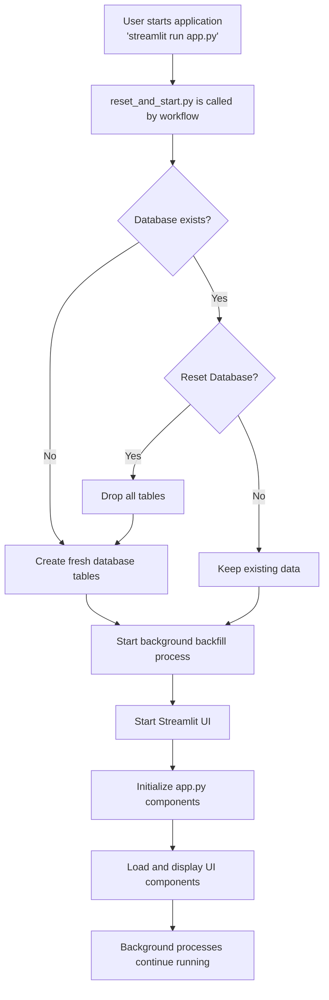
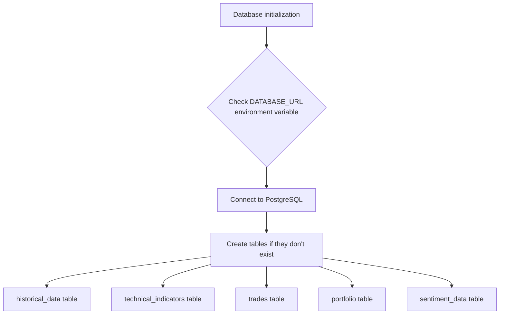
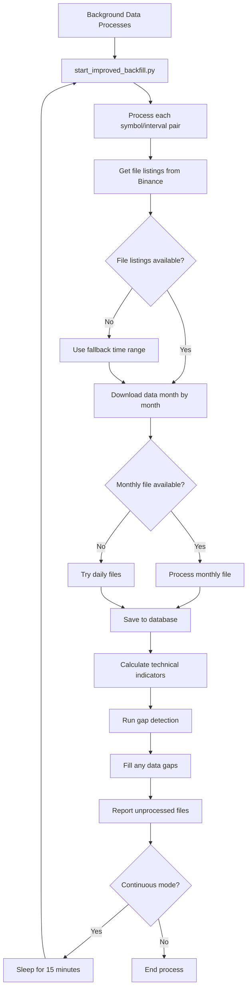
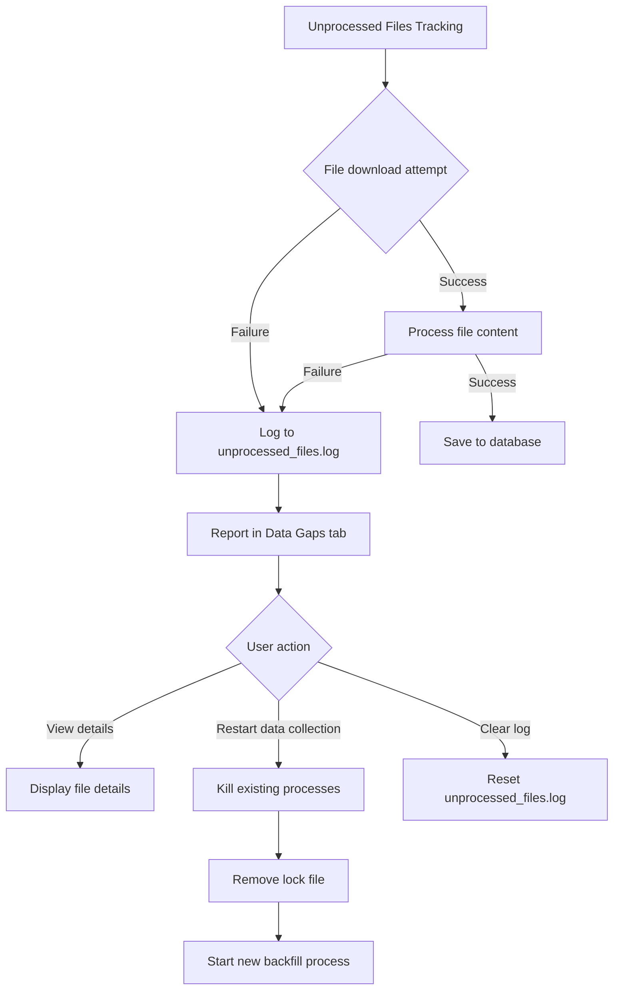
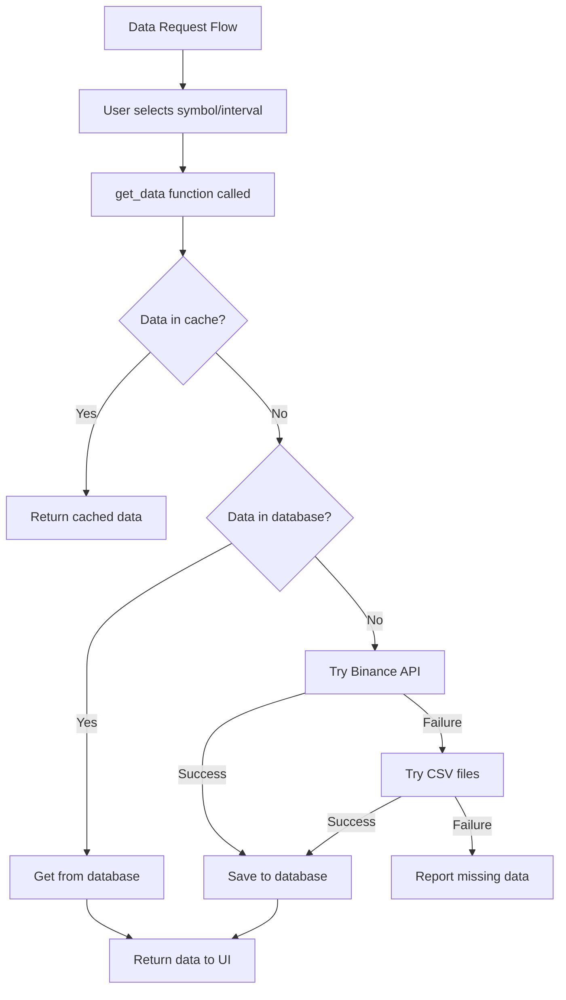
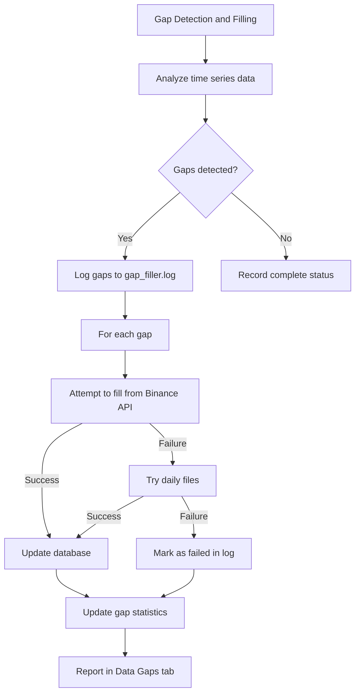

# Application Startup Flow Diagram

This document provides a visual representation of what happens when `streamlit run app.py` is executed, showing which processes are run and in which order.

## Main Application Flow

## Database Initialization Process

## Background Data Processes

## Unprocessed Files Tracking

## HTTP Request Flow for Data

## Gap Detection and Filling Process

This diagram represents the flow of execution when the application starts. It covers the main application startup, database initialization, background data processes, unprocessed files tracking, data request flow, and gap detection/filling process.